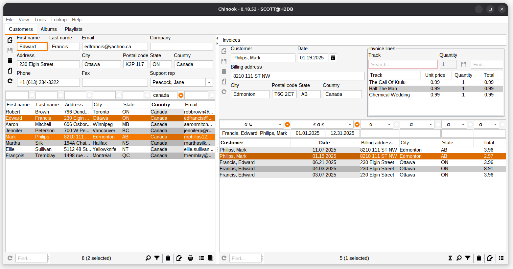

= Codion Chinook Demo

A demo application based on the https://codion.is[Codion application framework].

== Documentation

Build the tutorial by running this Gradle target:

[source,shell]
----
gradlew documentation:asciidoctor
----

...and browse the tutorial here:
[source]
----
documentation/build/docs/asciidoc/chinook.html
----

== Modules

Many of the following modules are configuration-only, that is, contain no source-code, just Gradle build files configuring the application for running and packaging.

=== chinook-domain-api

The domain model API.

=== chinook-domain

The domain model implementation.

=== chinook-domain-generator

Configuration for the Codion Domain Generator.

==== Run

[source,shell]
----
gradlew chinook-domain-generator:run
----

=== chinook-client

Swing client application.

=== chinook-client-local

Configuration only.
Swing client configured with a local JDBC connection.

==== Run

[source,shell]
----
gradlew chinook-client-local:run
----

NOTE: The client runs with an in-memory H2 database, created on startup, so changes to data do not persist.

==== Package

[source,shell]
----
gradlew chinook-client-local:jlink
gradlew chinook-client-local:jpackage
----

=== chinook-client-http

Configuration only.
Swing client configured with a HTTP connection.

==== Run

NOTE: The server must be running

[source,shell]
----
gradlew chinook-client-http:run
----

==== Package

[source,shell]
----
gradlew chinook-client-http:jlink
gradlew chinook-client-http:jpackage
----

=== chinook-client-remote

Configuration only.
Swing client configured with a RMI connection.

==== Run

NOTE: The server must be running

[source,shell]
----
gradlew chinook-client-remote:run
----

==== Package

[source,shell]
----
gradlew chinook-client-remote:jlink
gradlew chinook-client-remote:jpackage
----

=== chinook-load-test

Load-test for the application.

=== chinook-load-test-http

Configuration only.
Load-test with a HTTP connection.

==== Run

NOTE: The server must be running

[source,shell]
----
gradlew chinook-load-test-http:run
----

==== Package

[source,shell]
----
gradlew chinook-load-test-http:jlink
gradlew chinook-load-test-http:jpackage
----

=== chinook-load-test-remote

Configuration only.
Load-test with a RMI connection.

==== Run

NOTE: The server must be running

[source,shell]
----
gradlew chinook-load-test-remote:run
----

==== Package

[source,shell]
----
gradlew chinook-load-test-remote:jlink
gradlew chinook-load-test-remote:jpackage
----

=== chinook-server

Configuration only.
A Codion server configured for the Chinook application.

NOTE: The server runs with an in-memory H2 database, created on startup, so changes to data do not persist.

==== Configuration

The server host name and ports are configured in *gradle.properties*.

[source,shell]
----
serverHost=localhost
serverPort=2223
serverHttpPort=8088
serverRegistryPort=1098
serverAdminPort=4445
----

==== Run

[source,shell]
----
gradlew chinook-server:run
----

==== Package

[source,shell]
----
gradlew chinook-server:jlink
gradlew chinook-server:jpackage
----

=== chinook-server-monitor

Configuration only.
A Codion server monitor configured for the server.

==== Run

[source,shell]
----
gradlew chinook-server-monitor:run
----

==== Package

[source,shell]
----
gradlew chinook-server-monitor:jlink
gradlew chinook-server-monitor:jpackage
----

=== chinook-service

An example of using the Codion persistance layer in a webservice, based on https://javalin.io[Javalin].

==== Configuration

The service port is configured in *gradle.properties*.

[source,shell]
----
servicePort=8089
----

==== Run

[source,shell]
----
gradlew chinook-service:run
----

==== Package

[source,shell]
----
gradlew chinook-service:jlink
gradlew chinook-service:jpackage
----

=== chinook-service-load-test

A load-test for the service.

==== Run

NOTE: The service must be running

[source,shell]
----
gradlew chinook-service-load-test:run
----

==== Package

[source,shell]
----
gradlew chinook-service-load-test:jlink
gradlew chinook-service-load-test:jpackage
----